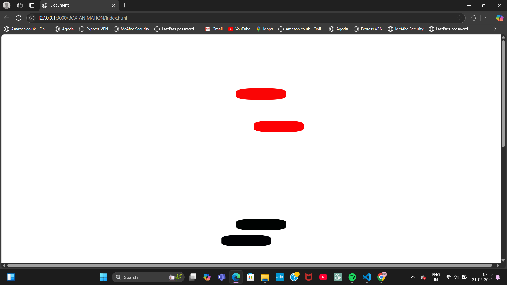

# 🎬 GSAP Animations Practice by Yukti

Welcome to my GSAP animation practice playground! This repo documents everything I'm learning and experimenting with as I explore the powerful [GreenSock Animation Platform (GSAP)](https://gsap.com/gsap/).

---

## 📌 What I'm Learning

I'm currently learning how to animate HTML elements using GSAP’s core methods like:

- `gsap.to()` – to animate properties *from current → target state*
- `gsap.from()` – to animate properties *from a starting state → current state*
- Animation properties such as:
  - `x`, `y` → for movement
  - `rotate` → rotation
  - `backgroundColor` → color changes
  - `duration`, `delay` → for timing
  - `repeat`, `yoyo` → to create looping and reversing animations

---

## ✨ What I’ve Built

In this current practice session, I animated four different boxes (`#box`, `#box2`, `#box3`, `#box4`) using combinations of GSAP properties.

### 🔄 Animation Features Explored:
- Infinite looping using `repeat: -1`
- Reversing animations with `yoyo: true`
- Staggered start times using `delay`
- Coordinated movement on the `x` and `y` axes
- Color transitions with `backgroundColor`
- Using both `.to()` and `.from()` methods

---

## 💡 Sample Code Snippet
```js
gsap.to("#box", {
  x: 100,
  duration: 3,
  delay: 1,
  backgroundColor: "red",
  yoyo: true,
  repeat: -1
});

## 📸 Project Screenshot


